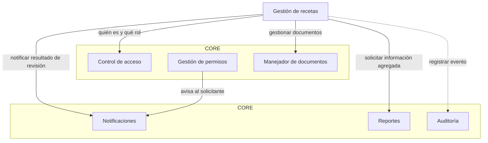
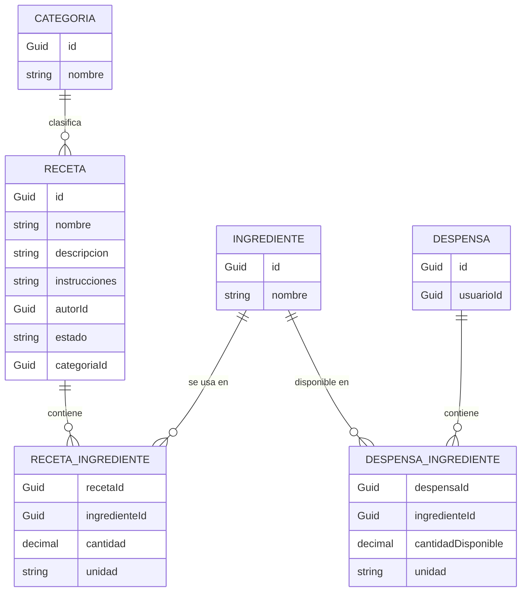

# WhatAreWeEating

Sistema de gestión y planificación de recetas — Programación III · ITLA · 2026-C-3.

Permite gestionar y organizar un catálogo de recetas, registrar los ingredientes disponibles en la despensa de cada usuario y determinar qué recetas se pueden preparar con lo que hay disponible. Construido con .NET 10, Entity Framework Core y SQL Server, dividido en un **Core** transversal (control de acceso, permisos, documentos, notificaciones, reportes, auditoría), un **módulo de negocio** de recetas independiente y una **API Web** host.

## Estructura del repositorio

```
WhatAreWeEating.slnx
src/
├── WhatAreWeEating.Api             # Host Web API, middleware de errores, Swagger
├── WhatAreWeEating.Core            # Piezas transversales (sin dependencias de negocio/infra)
├── WhatAreWeEating.Recetas         # Dominio: recetas, ingredientes, despensa
├── WhatAreWeEating.Infrastructure  # AppDbContext, Configurations/, Migrations/, DI
└── WhatAreWeEating.MailWorker      # Consola independiente: envía los correos en cola por SMTP
```

## Variables de entorno

> **Importante (RD-10):** Nunca incluir contraseñas, secretos ni cadenas de conexión con credenciales dentro del código fuente ni en archivos versionados (`appsettings.json`). Configurar siempre mediante variables de entorno en el host o sesión local.

| Variable | Propósito |
| :--- | :--- |
| `ConnectionStrings__Default` | Cadena de conexión principal hacia la base de datos SQL Server utilizada por EF Core (`AppDbContext`). |
| `ASPNETCORE_ENVIRONMENT` | Entorno de ejecución de ASP.NET Core (`Development`, `Staging`, `Production`). Habilita la interfaz de Swagger y documentación OpenAPI en `Development`. |
| `Jwt__Key` | Clave secreta con la que se firman los JWT de sesión (mínimo 32 caracteres). Obligatoria: si falta o es corta, la API no arranca y el mensaje nombra la variable sin mostrar su valor. |
| `Jwt__Issuer` | (Opcional) Emisor del JWT. Por defecto `WhatAreWeEating`. |
| `Jwt__Audience` | (Opcional) Audiencia del JWT. Por defecto `WhatAreWeEating.Api`. |
| `Seed__AdminEmail` | Correo del primer Administrador que se crea al arrancar la API. Si falta, no se siembra nada y se imprime un aviso. Si ya existe un usuario con ese correo, no se modifica. |
| `Seed__AdminName` | (Opcional) Nombre del administrador sembrado. Por defecto `Administrador`. |
| `Seed__AdminPassword` | Contraseña del administrador sembrado; debe cumplir la política de contraseñas y nunca se imprime. |
| `Smtp__Host` | Servidor SMTP que usa el MailWorker para enviar los correos en cola. |
| `Smtp__Port` | Puerto del servidor SMTP (número entre 1 y 65535). |
| `Smtp__User` | Usuario con el que el MailWorker se autentica en el servidor SMTP. |
| `Smtp__Password` | Contraseña (o contraseña de aplicación) de esa cuenta SMTP. Nunca se imprime ni se guarda en `UltimoError`. |
| `Smtp__From` | Dirección remitente que aparece en los correos enviados. |
| `Smtp__EnableSsl` | `true` o `false`: activa SSL/TLS en la conexión SMTP. |
| `App__BaseUrl` | URL base de la aplicación (ej. `http://localhost:5228`) utilizada para generar los enlaces de activación de cuenta en los correos en cola. |

## Cómo ejecutar el proyecto

### Requisitos

- .NET 10 SDK
- SQL Server (local, instancia Express o contenedor Docker)
- Herramienta `dotnet-ef` (opcional para migraciones): `dotnet tool install --global dotnet-ef`

### Pasos

1. **Clonar el repositorio:**
   ```bash
   git clone <url-del-repo>
   cd WhatAreWeEating
   ```

2. **Restaurar dependencias:**
   ```bash
   dotnet restore
   ```

3. **Configurar las variables de entorno:**
   ```powershell
   # PowerShell (Windows)
   $env:ConnectionStrings__Default = "Server=localhost;Database=WhatAreWeEating;Trusted_Connection=True;TrustServerCertificate=True;"
   $env:ASPNETCORE_ENVIRONMENT = "Development"
   $env:App__BaseUrl = "http://localhost:5228"
   ```
   ```bash
   # Bash / Linux / macOS
   export ConnectionStrings__Default="Server=localhost;Database=WhatAreWeEating;User Id=sa;Password=<tu-password>;TrustServerCertificate=True;"
   export ASPNETCORE_ENVIRONMENT="Development"
   export App__BaseUrl="http://localhost:5228"
   ```

4. **Compilar la solución:**
   ```bash
   dotnet build
   ```

5. **Aplicar las migraciones:**
   ```bash
   dotnet ef database update --project src/WhatAreWeEating.Infrastructure
   ```

6. **Ejecutar la API:**
   ```bash
   dotnet run --project src/WhatAreWeEating.Api
   ```

7. **Explorar documentación interactiva (Swagger UI):**
   - Abrir el navegador en `https://localhost:<puerto>/swagger`.

### Ejecutar el MailWorker (envío de correos)

El registro de usuarios solo **encola** el correo de activación; el envío real lo hace el `MailWorker`, un proceso aparte (RF-NOT-08, RF-NOT-09). Se ejecuta una vez, procesa los correos `Pendiente` uno por uno y termina.

1. Define las variables `Smtp__*` y `ConnectionStrings__Default` en la misma sesión (solo por variables de entorno, nunca en archivos del repositorio):
   ```powershell
   $env:Smtp__Host = "<servidor-smtp>"
   $env:Smtp__Port = "587"
   $env:Smtp__User = "<usuario>"
   $env:Smtp__Password = "<contraseña>"
   $env:Smtp__From = "<remitente@dominio>"
   $env:Smtp__EnableSsl = "true"
   ```
2. Ejecútalo:
   ```bash
   dotnet run --project src/WhatAreWeEating.MailWorker
   ```

Comportamiento:
- Correo enviado: `Estado = Enviado` y `FechaEnvio` en UTC. Un correo `Enviado` nunca se reenvía, así que ejecutarlo varias veces no duplica envíos (RF-NOT-12).
- Envío fallido: se incrementa `Intentos`, se guarda el motivo en `UltimoError` (sin contraseña ni traza), el correo sigue `Pendiente` y se continúa con el siguiente.
- Si falta o es inválida alguna variable `Smtp__*`, termina con código 2 y un mensaje que solo nombra la variable, sin mostrar valores.

### Probar el registro con el SMTP apagado

1. Levanta la API y registra un usuario en `POST /auth/registro`: responde `201` aunque no haya servidor SMTP, porque solo encola el correo.
2. Verifica que el correo quedó pendiente:
   ```sql
   SELECT Destinatario, Estado, Intentos, UltimoError FROM CorreosEnCola;
   ```
   Debe verse `Estado = Pendiente`, `Intentos = 0` y `UltimoError = NULL`.
3. (Opcional) Ejecuta el MailWorker con `Smtp__Host` apuntando a un servidor apagado: el correo sigue `Pendiente`, `Intentos` aumenta y `UltimoError` guarda el motivo.

---

## Cómo provocar cada criterio

### Registro de usuario (`POST /auth/registro`)

```json
{
  "nombre": "Ana Pérez",
  "correo": "ana@example.com",
  "password": "<contraseña-válida>"
}
```

`nombre` es obligatorio, no puede estar vacío ni ser solo espacios y admite máximo 100 caracteres; de lo contrario la API responde `400`.

### Sesión: login, me y logout

Antes de arrancar la API define `Jwt__Key` (mínimo 32 caracteres) en la misma sesión:
```powershell
$env:Jwt__Key = "<clave-aleatoria-de-32-o-mas-caracteres>"
```

**Login** (`POST /auth/login`, la cuenta debe estar activada):
```json
{ "correo": "ana@example.com", "password": "<contraseña>" }
```
Respuesta `200`: `{ "token": "...", "tipoToken": "Bearer", "expira": "..." }`. La sesión dura 8 horas.

**Me** (`GET /auth/me`) con la cabecera `Authorization: Bearer <token>` (o el botón *Authorize* de Swagger, pegando solo el token). Devuelve `{ "nombre", "correo", "rol" }`; sin sesión válida, `401`.

**Logout** (`POST /auth/logout`) con el mismo encabezado: responde `200` y revoca la sesión; usar el mismo token después da `401`.

```powershell
$t = (Invoke-RestMethod http://localhost:5228/auth/login -Method Post -ContentType 'application/json' `
      -Body '{"correo":"ana@example.com","password":"<contraseña>"}').token
Invoke-RestMethod http://localhost:5228/auth/me -Headers @{ Authorization = "Bearer $t" }
Invoke-RestMethod http://localhost:5228/auth/logout -Method Post -Headers @{ Authorization = "Bearer $t" }
```

Respuestas de login: `401` correo inexistente o contraseña incorrecta (mismo mensaje en ambos casos), `403` cuenta no activa (solo con contraseña correcta), `423` cuenta bloqueada 15 minutos tras 5 fallos seguidos, `400` datos vacíos.

### Administración de usuarios (solo Administrador)

El primer Administrador se crea al arrancar la API con `Seed__AdminEmail`, `Seed__AdminName` (opcional) y `Seed__AdminPassword`. Haz login con esa cuenta y usa su token (`$a`) en la cabecera `Authorization: Bearer`.

Qué rol puede ejecutar cada operación está declarado en un solo archivo: `src/WhatAreWeEating.Api/Auth/PoliciesCatalogo.cs`. El rol se lee de la base de datos en cada petición, no del token.

```powershell
$h = @{ Authorization = "Bearer $a" }; $u = "http://localhost:5228/admin/usuarios"

# Listar (id, nombre, correo, rol, activo; nunca hashes ni sesiones)
Invoke-RestMethod $u -Headers $h

# Cambiar rol: valores válidos "Administrador" o "Estandar" (otro valor: 400; usuario inexistente: 404)
Invoke-RestMethod "$u/<id>/rol" -Method Put -Headers $h -ContentType 'application/json' -Body '{"rol":"Administrador"}'

# Desactivar: Activo = false y revoca todas sus sesiones (a uno mismo: 409)
Invoke-RestMethod "$u/<id>/desactivar" -Method Post -Headers $h

# Reactivar
Invoke-RestMethod "$u/<id>/reactivar" -Method Post -Headers $h
```

- Un usuario `Estandar` que llama a cualquiera de estos endpoints recibe `403` en JSON; sin token, `401`.
- Un Administrador no puede desactivarse ni cambiarse el rol a sí mismo (`409`).
- Tras desactivar, el token del usuario devuelve `401` en la siguiente petición y su login devuelve `403`.

### Recuperación, restablecimiento y cambio de contraseña

El envío de correos lo hace el MailWorker; estos endpoints solo encolan el mensaje. Para leer el código en pruebas locales, consulta el cuerpo del correo encolado (`SELECT TOP 1 Cuerpo FROM CorreosEnCola WHERE Destinatario = '<correo>' ORDER BY FechaCreacion DESC`) o ejecuta el MailWorker.

```powershell
$api = "http://localhost:5228"

# 1) Recuperar (sin sesión): misma respuesta 200 exista o no el correo, esté activo o no.
#    Formato de correo inválido: 400. El código dura 30 minutos y los anteriores quedan invalidados.
Invoke-RestMethod "$api/auth/recuperar" -Method Post -ContentType 'application/json' `
  -Body '{"correo":"ana@example.com"}'

# 2) Restablecer (sin sesión) con el código del correo.
#    Código inexistente, usado o vencido: 400. Política de contraseña incumplida: 400.
#    Si es válido: cambia la contraseña, reinicia intentos y bloqueo, y revoca todas las sesiones.
Invoke-RestMethod "$api/auth/restablecer" -Method Post -ContentType 'application/json' `
  -Body '{"codigo":"<codigo-del-correo>","passwordNueva":"<nueva-contraseña>"}'

# 3) Cambiar contraseña (con sesión). Contraseña actual incorrecta: 400 y nada cambia.
#    Si sale bien se revocan TODAS las sesiones, incluida la actual: hay que iniciar sesión de nuevo.
Invoke-RestMethod "$api/auth/cambiar-password" -Method Post -Headers @{ Authorization = "Bearer $t" } `
  -ContentType 'application/json' -Body '{"passwordActual":"<actual>","passwordNueva":"<nueva>"}'

# 4) Forzar restablecimiento (solo Administrador): invalida la contraseña, revoca sesiones y encola un código.
#    Inexistente: 404. A uno mismo o usuario desactivado: 409.
Invoke-RestMethod "$api/admin/usuarios/<id>/forzar-restablecimiento" -Method Post -Headers @{ Authorization = "Bearer $a" }
```

<!-- Sección reservada para documentar los pasos y escenarios de prueba de cada criterio de aceptación y requisitos funcionales/no-funcionales del sistema. -->

---

## Diseño de componentes

### Diagrama de componentes



Todas las flechas van del módulo de negocio hacia el Core, nunca al revés: si se elimina `Negocio`, el Core sigue construyéndose y ejecutándose (RD-03). La relación con Auditoría se dibuja punteada porque esa pieza solo registra eventos, no orquesta ninguna operación.

### Interfaces del Core

**Control de acceso** — decide quién es el usuario, qué rol tiene, y si puede ejecutar la operación que está pidiendo.
- `Registrar(nombre, correo, contraseña)`
- `IniciarSesion(correo, contraseña) → credencial`
- `ObtenerUsuarioAutenticado(credencial) → usuario, rol`
- `CambiarRol(usuarioId, nuevoRol)` — solo Administrador
- `IniciarRecuperacion(correo)` / `RestablecerContraseña(código, nueva)`
- `ForzarRestablecimiento(usuarioId)` — solo Administrador
- `Autorizar(credencial, rolRequerido) → permitido/rechazado`

**Gestión de permisos** — gobierna el ciclo de vida de una solicitud de permiso (Pendiente → Aprobada/Rechazada → Aplicada), sin saber nada de recetas ni de auditoría.
- `CrearSolicitud(solicitanteId, permisoSolicitado)`
- `ListarPendientes(solicitanteId?)`
- `Aprobar(solicitudId, aprobadorId)`
- `Rechazar(solicitudId, aprobadorId, motivo)`

**Manejador de documentos** — guarda, lista y da de baja lógica archivos asociados a cualquier entidad del sistema, sin saber qué representa cada archivo.
- `Subir(archivo, usuarioId) → documentoId`
- `Listar(usuarioId)`
- `Descargar(documentoId, usuarioId)`
- `EliminarLogico(documentoId, usuarioId)`

**Notificaciones** — entrega un mensaje a un usuario por los canales disponibles (interno + correo) y administra la cola de envío.
- `Notificar(destinatarioId, tipo, mensaje)`
- `ListarPropias(usuarioId) → notificaciones`
- `MarcarLeida(notificacionId, usuarioId)`
- `DesactivarCanalCorreo(usuarioId)`
- `ProcesarCola()` — proceso independiente que envía lo pendiente

**Reportes** — responde preguntas agregadas sobre el Core y sobre el negocio, filtradas por rol y por rango de fechas; nunca devuelve listados crudos.
- `ReporteCore(tipo, rango, solicitante) → datos agregados`
- `ReporteNegocio(tipo, rango, solicitante) → datos agregados`

**Auditoría** — deja constancia inmutable de quién hizo qué, cuándo y con qué valores; de solo escritura desde afuera, de solo lectura filtrada hacia el Administrador.
- `Registrar(usuarioId, acción, entidad, entidadId, valorAnterior, valorNuevo)`
- `Consultar(usuarioId?, entidad?, rango) → registros` — solo Administrador

### Modelo de entidades del negocio



`RecetaIngrediente` y `DespensaIngrediente` son entidades propias, no solo llaves foráneas cruzadas: cada una guarda `cantidad`/`unidad`, dato que la funcionalidad de "qué recetas puedo preparar" necesita para comparar disponibilidad contra requerimiento (RF-NEG-01). `Despensa.usuarioId` referencia a `Usuario` del Core sin dibujar esa entidad aquí — el negocio conoce el id, pero no es dueño de esa entidad (RD-03 aplicado al modelo de datos).