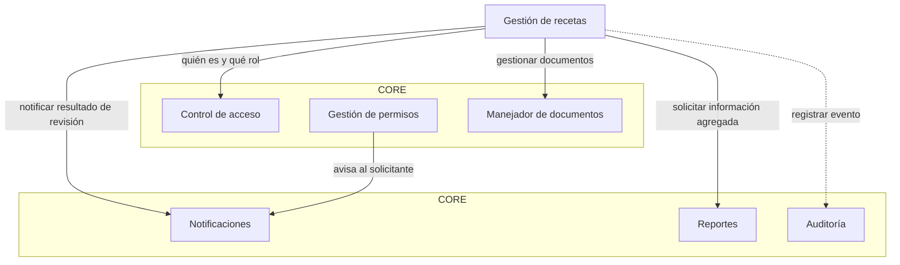
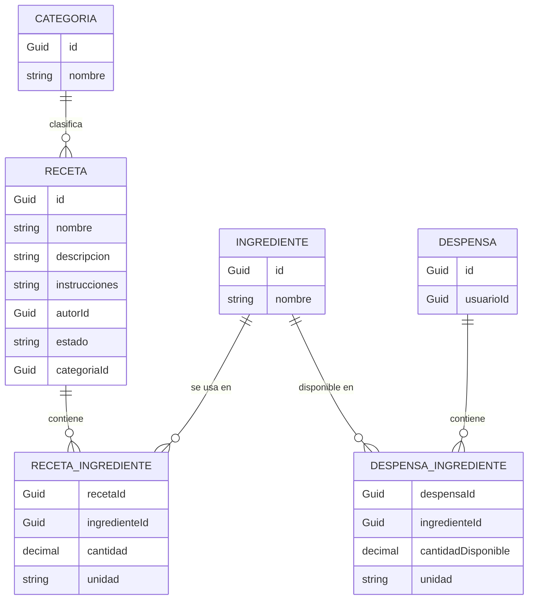

# WhatAreWeEating

Sistema de gestión y planificación de recetas — Programación III · ITLA · 2026-C-3.

Permite gestionar y organizar un catálogo de recetas, registrar los ingredientes disponibles en la despensa de cada usuario y determinar qué recetas se pueden preparar con lo que hay disponible. Construido con .NET 10, Entity Framework Core y SQL Server, dividido en un **Core** transversal (control de acceso, permisos, documentos, notificaciones, reportes, auditoría), un **módulo de negocio** de recetas independiente y una **API Web** host.

## Estructura del repositorio

```
WhatAreWeEating.slnx
docs/                               # Bitácoras, máquina de estados y verificación de requisitos
src/
├── WhatAreWeEating.Api             # Host Web API, autenticación JWT, endpoints, Swagger
├── WhatAreWeEating.Core            # Piezas transversales (no referencia a ningún otro proyecto, RD-03)
├── WhatAreWeEating.Recetas         # Dominio de negocio: recetas, ingredientes, despensa, máquina de estados
├── WhatAreWeEating.Infrastructure  # AppDbContext, Configurations/, Migrations/, servicios, DI
└── WhatAreWeEating.MailWorker      # Consola independiente: envía los correos en cola por SMTP
```

Reglas de dependencia: Core no referencia a nadie; Recetas referencia Core; Infrastructure referencia Core y Recetas; Api y MailWorker referencian lo que necesitan.

## Requisitos previos

| Herramienta | Para qué | Cómo comprobarla |
| :--- | :--- | :--- |
| .NET 10 SDK | Compilar y ejecutar | `dotnet --version` (debe empezar por `10.`) |
| SQL Server (local, Express o contenedor Docker) | Base de datos | Poder conectarse con `sqlcmd -S localhost -E -C -Q "SELECT 1"` |
| `dotnet-ef` | Aplicar migraciones | `dotnet ef --version`; si falta: `dotnet tool install --global dotnet-ef` |
| `sqlcmd` (o SSMS / Azure Data Studio) | Consultar la base en las pruebas | `sqlcmd -?` |
| PowerShell | Ejecutar los ejemplos de este README | `$PSVersionTable.PSVersion` |

Con SQL Server Express la instancia suele llamarse `localhost\SQLEXPRESS`; ajusta `Server=` en la cadena de conexión y `$srv` en los ejemplos.

## Variables de entorno

> **Importante (RD-10):** nunca se escriben contraseñas, claves ni cadenas de conexión con credenciales en el código ni en archivos versionados (`appsettings.json`). Todo se configura con variables de entorno de la sesión o del host. Esta tabla solo describe para qué sirve cada una; **nunca** incluye valores.

| Variable | Obligatoria | La usa | Para qué |
| :--- | :--- | :--- | :--- |
| `ConnectionStrings__Default` | Sí | API, MailWorker, `dotnet ef` | Cadena de conexión a la base SQL Server. |
| `ASPNETCORE_ENVIRONMENT` | No | API | Entorno de ASP.NET Core. En `Development` se habilita Swagger. Si ejecutas con `dotnet run`, el perfil de lanzamiento ya la define. |
| `Jwt__Key` | Sí | API | Clave con la que se firman los JWT de sesión (mínimo 32 caracteres). Si falta o es corta, la API no arranca y el mensaje nombra la variable sin mostrar su valor. |
| `Jwt__Issuer` | No | API | Emisor del JWT. Por defecto `WhatAreWeEating`. |
| `Jwt__Audience` | No | API | Audiencia del JWT. Por defecto `WhatAreWeEating.Api`. |
| `Seed__AdminEmail` | No | API | Correo del primer Administrador, que se crea al arrancar. Si falta, no se siembra nada y se imprime un aviso. Si el correo ya existe, no se modifica. |
| `Seed__AdminName` | No | API | Nombre del administrador sembrado. Por defecto `Administrador`. |
| `Seed__AdminPassword` | No | API | Contraseña del administrador sembrado; debe cumplir la política de contraseñas y nunca se imprime. |
| `App__BaseUrl` | No | API | URL base de la API, usada para armar el enlace de activación de los correos en cola. Por defecto, la del propio request. |
| `Smtp__Host` | Sí | MailWorker | Servidor SMTP con el que se envían los correos en cola. |
| `Smtp__Port` | Sí | MailWorker | Puerto del servidor SMTP (número entre 1 y 65535). |
| `Smtp__User` | Sí | MailWorker | Usuario con el que el worker se autentica en el servidor SMTP. |
| `Smtp__Password` | Sí | MailWorker | Contraseña (o contraseña de aplicación) de esa cuenta SMTP. Nunca se imprime ni se guarda en `UltimoError`. |
| `Smtp__From` | Sí | MailWorker | Dirección remitente de los correos. |
| `Smtp__EnableSsl` | Sí | MailWorker | `true` o `false`: activa SSL/TLS en la conexión SMTP. |

## Cómo ejecutar el proyecto

Los comandos se ejecutan desde la raíz del repositorio. Los ejemplos usan PowerShell (Windows).

1. **Clonar y restaurar:**
   ```powershell
   git clone <url-del-repo>
   cd WhatAreWeEating
   dotnet restore
   ```

2. **Definir las variables de entorno** (solo valen para la ventana de PowerShell donde las escribes):
   ```powershell
   $env:ConnectionStrings__Default = "Server=localhost;Database=WhatAreWeEating;Trusted_Connection=True;TrustServerCertificate=True;"
   $env:App__BaseUrl = "http://localhost:5228"

   # Clave JWT aleatoria de 64 caracteres (genera una distinta para cada entorno)
   $bytes = New-Object byte[] 48; [Security.Cryptography.RandomNumberGenerator]::Create().GetBytes($bytes)
   $env:Jwt__Key = [Convert]::ToBase64String($bytes)

   # Primer Administrador (opcional pero necesario para las pruebas de administración)
   $env:Seed__AdminEmail = "admin@whatareweating.test"
   $env:Seed__AdminPassword = "<contraseña-válida: mínimo 8 caracteres, con letra y número>"
   ```
   Con autenticación SQL en vez de la de Windows: `Server=localhost;Database=WhatAreWeEating;User Id=<usuario>;Password=<contraseña>;TrustServerCertificate=True;`.

3. **Compilar:**
   ```powershell
   dotnet build
   ```

4. **Aplicar las migraciones** (crea la base si no existe). Hazlo con la API detenida, porque una API en ejecución bloquea los archivos al recompilar:
   ```powershell
   dotnet ef database update --project src/WhatAreWeEating.Infrastructure --startup-project src/WhatAreWeEating.Api
   ```

5. **Ejecutar la API** (el perfil de lanzamiento la deja en `http://localhost:5228`):
   ```powershell
   dotnet run --project src/WhatAreWeEating.Api
   ```
   Al arrancar imprime `Siembra: administrador inicial creado.` la primera vez (o un aviso si faltan variables `Seed__*`). Comprueba que responde: `Invoke-RestMethod http://localhost:5228/` devuelve `status = Healthy`.

6. **Swagger:** abre `http://localhost:5228/swagger`. Para los endpoints protegidos, haz `POST /auth/login`, pulsa **Authorize** y pega solo el token (sin la palabra `Bearer`).

### Ejecutar el MailWorker (envío de correos)

El registro, la recuperación y el forzado de contraseña solo **encolan** correos en `CorreosEnCola`; el envío real lo hace el `MailWorker`, un proceso aparte que se ejecuta una vez, procesa los correos `Pendiente` uno por uno y termina (no se queda en bucle).

En otra ventana de PowerShell, desde la raíz del repositorio:

```powershell
$env:ConnectionStrings__Default = "Server=localhost;Database=WhatAreWeEating;Trusted_Connection=True;TrustServerCertificate=True;"
$env:Smtp__Host = "<servidor-smtp>"
$env:Smtp__Port = "587"
$env:Smtp__User = "<usuario>"
$env:Smtp__Password = "<contraseña-o-contraseña-de-aplicación>"
$env:Smtp__From = "<remitente@dominio>"
$env:Smtp__EnableSsl = "true"
dotnet run --project src/WhatAreWeEating.MailWorker
```

Códigos de salida: `0` terminó de vaciar la cola (aunque algún envío haya fallado), `2` falta o es inválida alguna variable (el mensaje solo nombra la variable, nunca el valor), `1` error inesperado.

Para probar sin un servidor real, ver [Servidor SMTP de prueba local](#servidor-smtp-de-prueba-local) más abajo.

---

## Cómo provocar cada criterio de aceptación

Esta sección se puede seguir de arriba hacia abajo. Cada criterio tiene un ejemplo y el resultado esperado. Los ejemplos se probaron contra la API con el flujo exacto de abajo.

### Preparación

1. **Ventana 1 (API):** sigue los pasos de *Cómo ejecutar el proyecto* con `Seed__AdminEmail = admin@whatareweating.test` y `Seed__AdminPassword` igual a la **contraseña de prueba 1** que usarás abajo.
2. **Ventana 2 (pruebas):** define las funciones auxiliares (pégalas completas). Pedirá tres contraseñas de prueba distintas, que cumplan la política (mínimo 8 caracteres, con letra y número). La primera debe coincidir con `Seed__AdminPassword`.

```powershell
$api = "http://localhost:5228"; $srv = "localhost"; $db = "WhatAreWeEating"
$pw  = Read-Host "Contraseña de prueba 1 (igual a Seed__AdminPassword)"
$pw2 = Read-Host "Contraseña de prueba 2 (distinta)"
$pw3 = Read-Host "Contraseña de prueba 3 (distinta)"

# Llama a la API y muestra "<código HTTP> <cuerpo>" (también en los errores 4xx/5xx)
function Llamar($m, $ruta, $cuerpo = $null, $token = $null) {
    $h = @{}; if ($token) { $h.Authorization = "Bearer $token" }
    $a = @{ Uri = "$api$ruta"; Method = $m; Headers = $h; UseBasicParsing = $true }
    if ($null -ne $cuerpo) { $a.ContentType = 'application/json'; $a.Body = ($cuerpo | ConvertTo-Json) }
    try { $r = Invoke-WebRequest @a; $s = [int]$r.StatusCode; $c = $r.Content }
    catch {
        $resp = $_.Exception.Response; $s = [int]$resp.StatusCode; $c = $_.ErrorDetails.Message
        if (-not $c -and $resp.PSObject.Methods['GetResponseStream']) {
            $st = $resp.GetResponseStream(); $st.Position = 0; $c = [IO.StreamReader]::new($st).ReadToEnd()
        }
    }
    "$s $c"
}
# Inicia sesión y devuelve el token
function Login($correo, $pass) {
    (Invoke-RestMethod "$api/auth/login" -Method Post -ContentType 'application/json' `
        -Body (@{ correo = $correo; password = $pass } | ConvertTo-Json)).token
}
# Ejecuta una consulta SQL (con autenticación SQL añade -U <usuario> -P <contraseña> y quita -E)
function Sql($q) { (sqlcmd -S $srv -d $db -E -C -h -1 -W -Q "SET NOCOUNT ON; $q") -join "`n" }
# Como no se envían correos reales, el token/código se lee del Cuerpo del correo en cola
function TokenActivacion($correo) {
    (Sql "SELECT TOP 1 SUBSTRING(Cuerpo,CHARINDEX('token=',Cuerpo)+6,43) FROM CorreosEnCola WHERE Destinatario='$correo' AND Asunto LIKE '%ctivaci%' ORDER BY FechaCreacion DESC").Trim()
}
function CodigoRecuperacion($correo) {
    (Sql "SELECT TOP 1 SUBSTRING(Cuerpo,CHARINDEX('es:'+CHAR(10),Cuerpo)+4,43) FROM CorreosEnCola WHERE Destinatario='$correo' AND (Asunto LIKE '%Recuperaci%' OR Asunto LIKE '%Restablecimiento%') ORDER BY FechaCreacion DESC").Trim()
}
function IdUsuario($correo) { (Sql "SELECT CAST(Id AS varchar(36)) FROM Usuarios WHERE Correo='$correo'").Trim() }
```

> Los tokens y códigos nunca se guardan en claro: en la base solo hay su hash SHA-256; el valor en claro únicamente existe en el `Cuerpo` del correo en cola.

Índice de criterios:

| Criterio | Sección |
| :--- | :--- |
| RF-CA-01, 14, 15, 02 | [1. Registro](#1-registro-y-activación) |
| RF-CA-16, 17 | [1. Registro y activación](#1-registro-y-activación) |
| RF-CA-03, 07, 18, 19 | [2. Sesión](#2-sesión-login-me-logout-y-bloqueo) |
| RF-CA-04, 05, 06, 08, 20, 21 | [3. Roles y administración](#3-roles-y-administración-de-usuarios) |
| RF-CA-09, 10, 11, 12, 14, 22 | [4. Contraseñas](#4-recuperación-restablecimiento-y-cambio-de-contraseña) |
| RF-CA-13 | [5. Forzar restablecimiento](#5-forzar-restablecimiento-solo-administrador) |
| RF-NOT-08, 09, 12, 13 | [6. Envío de correos](#6-envío-de-correos-mailworker) |
| RF-NEG-03, 04, 05, 09 | [7. Máquina de estados](#7-máquina-de-estados-de-receta) |

### 1. Registro y activación

```powershell
# RF-CA-01 registro válido: 201. Mismo correo otra vez: 400. Nombre vacío o solo espacios: 400. Correo con formato inválido: 400.
Llamar Post '/auth/registro' @{ nombre = 'Ana Perez'; correo = 'ana@example.com'; password = $pw }
Llamar Post '/auth/registro' @{ nombre = 'Ana Perez'; correo = 'ana@example.com'; password = $pw }
Llamar Post '/auth/registro' @{ nombre = '   '; correo = 'x@example.com'; password = $pw }
Llamar Post '/auth/registro' @{ nombre = 'X'; correo = 'hola'; password = $pw }

# RF-CA-14 política de contraseña (mín. 8 caracteres, una letra y un número): 400
Llamar Post '/auth/registro' @{ nombre = 'X'; correo = 'x@example.com'; password = 'abc' }

# RF-CA-02 la contraseña nunca se guarda en claro: la base solo tiene un hash PBKDF2 con sal ("iteraciones.sal.hash")
Sql "SELECT LEFT(PasswordHash,7)+'...' FROM Usuarios WHERE Correo='ana@example.com'"     # 100000....

# RF-CA-15 una cuenta sin activar no entra aunque la contraseña sea correcta (403) y el correo de activación
# solo queda encolado (Pendiente), nunca se envía dentro de la operación
Llamar Post '/auth/login' @{ correo = 'ana@example.com'; password = $pw }
Sql "SELECT Estado FROM CorreosEnCola WHERE Destinatario='ana@example.com'"

# RF-CA-16 activar con el token del correo: 200. El mismo token otra vez, o uno inventado: 400
$tk = TokenActivacion 'ana@example.com'
Llamar Get "/auth/activar?token=$tk"
Llamar Get "/auth/activar?token=$tk"
Llamar Get "/auth/activar?token=abc"

# RF-CA-17 reenvío de activación: la respuesta es idéntica exista o no el correo, y el token anterior deja de servir
Llamar Post '/auth/registro' @{ nombre = 'Carla'; correo = 'carla@example.com'; password = $pw } | Out-Null
$viejo = TokenActivacion 'carla@example.com'
Llamar Post '/auth/reenviar-activacion' @{ correo = 'carla@example.com' }
Llamar Post '/auth/reenviar-activacion' @{ correo = 'nadie@example.com' }
Llamar Get "/auth/activar?token=$viejo"                  # 400: el token viejo quedó invalidado

# RF-CA-16 token vencido: se fuerza el vencimiento en la base y se intenta activar (400)
$nuevo = TokenActivacion 'carla@example.com'
Sql "UPDATE TokensUnUso SET FechaVencimiento = DATEADD(MINUTE,-1,SYSUTCDATETIME()) WHERE UsuarioId=(SELECT Id FROM Usuarios WHERE Correo='carla@example.com') AND Usado=0" | Out-Null
Llamar Get "/auth/activar?token=$nuevo"
```

### 2. Sesión: login, me, logout y bloqueo

```powershell
# RF-CA-03 correo inexistente y contraseña incorrecta: mismo código (401) y mismo mensaje
Llamar Post '/auth/login' @{ correo = 'nadie@example.com'; password = $pw }
Llamar Post '/auth/login' @{ correo = 'ana@example.com'; password = $pw3 }

# Login correcto: 200 con { token, tipoToken, expira }. La sesión dura 8 horas
$t = Login 'ana@example.com' $pw

# RF-CA-07 usuario autenticado: nombre, correo y rol (nunca hashes). Sin token: 401
Llamar Get '/auth/me' $null $t
Llamar Get '/auth/me'

# RF-CA-18 logout: 200; el mismo token después da 401
Llamar Post '/auth/logout' $null $t
Llamar Get '/auth/me' $null $t

# RF-CA-19 cinco fallos seguidos bloquean 15 minutos: con la contraseña correcta responde 423
Llamar Post '/auth/registro' @{ nombre = 'Beto'; correo = 'beto@example.com'; password = $pw } | Out-Null
Llamar Get "/auth/activar?token=$(TokenActivacion 'beto@example.com')" | Out-Null
1..5 | ForEach-Object { Llamar Post '/auth/login' @{ correo = 'beto@example.com'; password = $pw3 } }
Llamar Post '/auth/login' @{ correo = 'beto@example.com'; password = $pw }          # 423
# Para repetir sin esperar 15 minutos:
Sql "UPDATE Usuarios SET IntentosFallidos = 0, BloqueadoHasta = NULL WHERE Correo = 'beto@example.com'" | Out-Null
```

### 3. Roles y administración de usuarios

El rol que se usa para autorizar se lee de la base de datos en cada petición (RD-06). Qué rol puede ejecutar cada operación está declarado en un solo archivo: `src/WhatAreWeEating.Api/Auth/PoliciesCatalogo.cs` (RF-CA-05).

```powershell
$a = Login 'admin@whatareweating.test' $pw                 # Administrador sembrado con Seed__*
$t = Login 'ana@example.com' $pw                   # Estándar
$idAna = IdUsuario 'ana@example.com'; $idBeto = IdUsuario 'beto@example.com'; $idAdmin = IdUsuario 'admin@whatareweating.test'

# RF-CA-05 catálogo único: abre este archivo y lee operación -> rol
Get-Content src/WhatAreWeEating.Api/Auth/PoliciesCatalogo.cs

# RF-CA-06 un Estándar que llama una operación de Administrador recibe 403 (JSON controlado); sin token, 401
Llamar Get '/admin/usuarios' $null $t
Llamar Get '/admin/usuarios'

# RF-CA-21 listado: solo id, nombre, correo, rol y activo (nunca hashes, sales, tokens ni sesiones)
$lista = Llamar Get '/admin/usuarios' $null $a
(($lista.Substring(4) | ConvertFrom-Json)[0].PSObject.Properties.Name) -join ', '

# RF-CA-04 cambiar rol (solo "Administrador" o "Estandar"; otro valor: 400)
Llamar Put "/admin/usuarios/$idAna/rol" @{ rol = 'Root' } $a
Llamar Put "/admin/usuarios/$idAna/rol" @{ rol = 'Administrador' } $a
Llamar Get '/admin/usuarios' $null $t               # 200: el MISMO token de Ana ya tiene el rol nuevo (RD-06)
Llamar Put "/admin/usuarios/$idAna/rol" @{ rol = 'Estandar' } $a
Llamar Get '/admin/usuarios' $null $t               # 403 otra vez

# RF-CA-08 usuario inexistente: 404 controlado
Llamar Put "/admin/usuarios/$([guid]::NewGuid())/rol" @{ rol = 'Estandar' } $a

# RF-CA-20 un Administrador no puede desactivarse a sí mismo (409). Desactivar a otro revoca sus sesiones
Llamar Post "/admin/usuarios/$idAdmin/desactivar" $null $a
$sb = Login 'beto@example.com' $pw
Llamar Post "/admin/usuarios/$idBeto/desactivar" $null $a        # 200
Llamar Get '/auth/me' $null $sb                                  # 401: su sesión abierta dejó de valer
Llamar Post '/auth/login' @{ correo = 'beto@example.com'; password = $pw }   # 403
Llamar Post "/admin/usuarios/$idBeto/reactivar" $null $a         # 200
```

### 4. Recuperación, restablecimiento y cambio de contraseña

```powershell
# RF-CA-09 recuperar: misma respuesta (200 y mismo mensaje) con correo activo, inexistente o sin activar. Formato inválido: 400
Llamar Post '/auth/recuperar' @{ correo = 'ana@example.com' }
Llamar Post '/auth/recuperar' @{ correo = 'nadie@example.com' }
Llamar Post '/auth/recuperar' @{ correo = 'carla@example.com' }
Llamar Post '/auth/recuperar' @{ correo = 'hola' }

# RF-CA-10 solo el correo activo genera un correo Pendiente en la cola (el envío NO ocurre dentro de la operación)
Sql "SELECT Destinatario, Estado FROM CorreosEnCola WHERE Asunto LIKE '%Recuperaci%'"

# RF-CA-10 un código nuevo invalida el anterior; inexistente, usado o vencido: 400 y la contraseña no cambia
$c1 = CodigoRecuperacion 'ana@example.com'
Llamar Post '/auth/recuperar' @{ correo = 'ana@example.com' } | Out-Null
$c2 = CodigoRecuperacion 'ana@example.com'
Llamar Post '/auth/restablecer' @{ codigo = $c1; passwordNueva = $pw2 }          # 400: el primero quedó inválido
Llamar Post '/auth/restablecer' @{ codigo = 'inventado'; passwordNueva = $pw2 }   # 400

# RF-CA-14 contraseña débil: 400 y el código NO se consume
Llamar Post '/auth/restablecer' @{ codigo = $c2; passwordNueva = 'abc' }

# RF-CA-11 y RF-CA-12 restablecer: 200, guarda el nuevo hash, marca el código como usado y revoca TODAS las sesiones
$sesionVieja = Login 'ana@example.com' $pw
Llamar Post '/auth/restablecer' @{ codigo = $c2; passwordNueva = $pw2 }
Llamar Get '/auth/me' $null $sesionVieja                                          # 401
Llamar Post '/auth/login' @{ correo = 'ana@example.com'; password = $pw }         # 401: la contraseña anterior ya no sirve
Llamar Post '/auth/login' @{ correo = 'ana@example.com'; password = $pw2 }        # 200
Llamar Post '/auth/restablecer' @{ codigo = $c2; passwordNueva = $pw3 }           # 400: código ya usado

# RF-CA-10 código vencido: se fuerza el vencimiento y se intenta usar (400)
Llamar Post '/auth/recuperar' @{ correo = 'ana@example.com' } | Out-Null
$c3 = CodigoRecuperacion 'ana@example.com'
Sql "UPDATE TokensUnUso SET FechaVencimiento = DATEADD(MINUTE,-1,SYSUTCDATETIME()) WHERE Tipo='RecuperacionPassword' AND Usado=0 AND UsuarioId=(SELECT Id FROM Usuarios WHERE Correo='ana@example.com')" | Out-Null
Llamar Post '/auth/restablecer' @{ codigo = $c3; passwordNueva = $pw3 }

# RF-CA-22 cambiar contraseña con sesión: sin sesión 401; contraseña actual incorrecta 400 y nada cambia
$s1 = Login 'ana@example.com' $pw2; $s2 = Login 'ana@example.com' $pw2
Llamar Post '/auth/cambiar-password' @{ passwordActual = $pw2; passwordNueva = $pw3 }
Llamar Post '/auth/cambiar-password' @{ passwordActual = $pw3; passwordNueva = $pw3 } $s1
Llamar Post '/auth/cambiar-password' @{ passwordActual = $pw2; passwordNueva = 'abc' } $s1         # RF-CA-14: 400

# RF-CA-12 cambio correcto: 200 y se revocan TODAS las sesiones, incluida la actual
Llamar Post '/auth/cambiar-password' @{ passwordActual = $pw2; passwordNueva = $pw3 } $s1
Llamar Get '/auth/me' $null $s1                                                  # 401
Llamar Get '/auth/me' $null $s2                                                  # 401
Llamar Post '/auth/login' @{ correo = 'ana@example.com'; password = $pw3 }       # 200
```

### 5. Forzar restablecimiento (solo Administrador)

```powershell
# RF-CA-13 el Administrador invalida la contraseña de un usuario: revoca sus sesiones y le encola un código
$sf = Login 'ana@example.com' $pw3
Llamar Post "/admin/usuarios/$idAna/forzar-restablecimiento" $null $sf                       # 403 (Estándar)
Llamar Post "/admin/usuarios/$([guid]::NewGuid())/forzar-restablecimiento" $null $a          # 404
Llamar Post "/admin/usuarios/$idAdmin/forzar-restablecimiento" $null $a                      # 409 (a sí mismo)
Llamar Post "/admin/usuarios/$idAna/forzar-restablecimiento" $null $a                        # 200
Llamar Get '/auth/me' $null $sf                                                              # 401
Llamar Post '/auth/login' @{ correo = 'ana@example.com'; password = $pw3 }                   # 401: ya no puede entrar con su contraseña
Sql "SELECT TOP 1 Estado FROM CorreosEnCola WHERE Destinatario='ana@example.com' AND Asunto LIKE '%Restablecimiento%'"   # Pendiente
Llamar Post '/auth/restablecer' @{ codigo = (CodigoRecuperacion 'ana@example.com'); passwordNueva = $pw }   # 200
```

### 6. Envío de correos (MailWorker)

Hasta aquí los correos solo estaban en cola. Ahora los envía el worker.

#### Servidor SMTP de prueba local

Si no tienes un servidor SMTP real, abre **otra ventana de PowerShell**, pega esto y déjala abierta (se detiene con `Ctrl+C`). Acepta cualquier mensaje y no entrega nada a nadie:

```powershell
$l = [Net.Sockets.TcpListener]::new([Net.IPAddress]::Loopback, 2525); $l.Start()
while ($true) {
    $c = $l.AcceptTcpClient(); $s = $c.GetStream()
    $r = [IO.StreamReader]::new($s); $w = [IO.StreamWriter]::new($s); $w.AutoFlush = $true
    $w.WriteLine('220 smtp-falso'); $datos = $false
    while (($linea = $r.ReadLine()) -ne $null) {
        if ($datos) { if ($linea -eq '.') { $datos = $false; $w.WriteLine('250 ok') }; continue }
        $u = $linea.ToUpper()
        if ($u.StartsWith('EHLO')) { $w.WriteLine('250 smtp-falso') }
        elseif ($u.StartsWith('DATA')) { $w.WriteLine('354 adelante'); $datos = $true }
        elseif ($u.StartsWith('QUIT')) { $w.WriteLine('221 adios'); break }
        else { $w.WriteLine('250 ok') }
    }
    $c.Close()
}
```

#### Pruebas del worker

En la ventana de pruebas (la misma donde definiste las funciones auxiliares), desde la raíz del repositorio (no pipes la salida a `Select -First`, porque cortaría el worker a medias):

```powershell
$env:ConnectionStrings__Default = "Server=localhost;Database=WhatAreWeEating;Trusted_Connection=True;TrustServerCertificate=True;"
$env:Smtp__Host = "127.0.0.1"; $env:Smtp__Port = "2525"; $env:Smtp__User = "usuario"
$env:Smtp__Password = "no-importa"; $env:Smtp__From = "no-reply@example.com"; $env:Smtp__EnableSsl = "false"

# (Primero, con el SMTP de prueba APAGADO: ciérralo o no lo abras todavía)
# RF-NOT-08 el SMTP caído no rompe la operación: los registros, recuperaciones y forzados de las secciones anteriores
# terminaron bien y sus correos están encolados como Pendiente
Sql "SELECT COUNT(*) AS Pendientes FROM CorreosEnCola WHERE Estado='Pendiente'"
# Con el SMTP caído el worker no puede enviar: el correo sigue Pendiente, suma un intento y guarda el motivo
# (sin contraseña ni traza). Los reintentos y el estado Fallido llegan en la semana 11
dotnet run --project src/WhatAreWeEating.MailWorker
Sql "SELECT TOP 3 Destinatario, Estado, Intentos, LEFT(UltimoError,70) FROM CorreosEnCola WHERE Estado='Pendiente'"

# Enciende el SMTP de prueba y ejecuta de nuevo:
# RF-NOT-09 el proceso independiente toma los pendientes y los envía (una línea por correo) y termina al vaciar la cola
dotnet run --project src/WhatAreWeEating.MailWorker
Sql "SELECT COUNT(*) AS Pendientes FROM CorreosEnCola WHERE Estado='Pendiente'"      # 0
Sql "SELECT TOP 3 Destinatario, Estado, FechaEnvio FROM CorreosEnCola WHERE Estado='Enviado'"

# RF-NOT-12 un correo Enviado no se reenvía: una segunda ejecución no envía nada (Enviados=0)
dotnet run --project src/WhatAreWeEating.MailWorker

# RF-NOT-13 las credenciales SMTP se leen solo de variables de entorno: sin Smtp__* el worker termina con código 2
# y nombra las variables que faltan, sin valores
Remove-Item Env:Smtp__*; dotnet run --project src/WhatAreWeEating.MailWorker; $LASTEXITCODE
```

Con un SMTP real (por ejemplo Gmail, `smtp.gmail.com`, puerto `587`, `Smtp__EnableSsl = true` y una contraseña de aplicación) los mensajes llegan a las bandejas reales; usa correos tuyos.

### 7. Máquina de estados de Receta

La máquina de estados es estructura del módulo de negocio (todavía sin endpoints): estados en `src/WhatAreWeEating.Recetas/Enums/EstadoReceta.cs`, transiciones en `src/WhatAreWeEating.Recetas/Estados/TransicionesReceta.cs` y la tabla explicada en [docs/maquina-de-estados.md](docs/maquina-de-estados.md). No comparte enums ni código con la máquina de permisos del Core (RF-NEG-09).

```powershell
# RF-NEG-03 toda receta nueva (y las existentes al migrar) queda en Borrador: la columna lo declara como valor por defecto
Sql "SELECT COLUMN_DEFAULT FROM INFORMATION_SCHEMA.COLUMNS WHERE TABLE_NAME='Recetas' AND COLUMN_NAME='Estado'"
```

Para consultar la tabla de transiciones, crea un archivo `verificar-estados.cs` en la raíz del repositorio (no lo subas a git; bórralo después) con este contenido y ejecútalo con `dotnet run verificar-estados.cs`:

```csharp
#:project src/WhatAreWeEating.Recetas/WhatAreWeEating.Recetas.csproj

using WhatAreWeEating.Recetas.Enums;
using WhatAreWeEating.Recetas.Estados;

// RF-NEG-04: solo las transiciones de la tabla están permitidas
foreach (var origen in Enum.GetValues<EstadoReceta>())
    foreach (var destino in Enum.GetValues<EstadoReceta>())
        if (TransicionesReceta.EsTransicionPermitida(origen, destino))
            Console.WriteLine($"{origen} -> {destino}: PERMITIDA");

// RF-NEG-04: prohibida explícita
var ok = TransicionesReceta.EsTransicionPermitida(EstadoReceta.Borrador, EstadoReceta.Publicada);
Console.WriteLine($"Borrador -> Publicada: {(ok ? "PERMITIDA" : "PROHIBIDA")}");

// RF-NEG-05: Archivada es terminal
foreach (var destino in Enum.GetValues<EstadoReceta>())
    if (TransicionesReceta.EsTransicionPermitida(EstadoReceta.Archivada, destino))
        Console.WriteLine("ERROR: Archivada tiene salida");
Console.WriteLine("Archivada sin transiciones de salida: OK");
```

Resultado esperado: las cinco transiciones permitidas (`Borrador -> EnRevision`, `EnRevision -> Publicada`, `EnRevision -> Rechazada`, `Rechazada -> Borrador`, `Publicada -> Archivada`), `Borrador -> Publicada: PROHIBIDA` y `Archivada sin transiciones de salida: OK`.

### Limpieza de los datos de prueba

Borra solo lo creado por estos ejemplos (usuarios `@example.com`; el Administrador sembrado usa otro dominio y no se borra), en este orden por las claves foráneas:

```powershell
$in = "(SELECT Id FROM Usuarios WHERE Correo LIKE '%@example.com')"
Sql "DELETE FROM Sesiones WHERE UsuarioId IN $in; DELETE FROM TokensUnUso WHERE UsuarioId IN $in; DELETE FROM CorreosEnCola WHERE Destinatario LIKE '%@example.com'; DELETE FROM Usuarios WHERE Correo LIKE '%@example.com'" | Out-Null
```

Si tu base ya tiene usuarios reales con correos `@example.com`, no ejecutes esta limpieza tal cual.

---

## Diseño de componentes

### Diagrama de componentes



Todas las flechas van del módulo de negocio hacia el Core, nunca al revés: si se elimina `Negocio`, el Core sigue construyéndose y ejecutándose (RD-03). La relación con Auditoría se dibuja punteada porque esa pieza solo registra eventos, no orquesta ninguna operación.

### Interfaces del Core

**Control de acceso** — decide quién es el usuario, qué rol tiene, y si puede ejecutar la operación que está pidiendo.
- `Registrar(nombre, correo, contraseña)`
- `IniciarSesion(correo, contraseña) → credencial`
- `ObtenerUsuarioAutenticado(credencial) → usuario, rol`
- `CambiarRol(usuarioId, nuevoRol)` — solo Administrador
- `IniciarRecuperacion(correo)` / `RestablecerContraseña(código, nueva)`
- `ForzarRestablecimiento(usuarioId)` — solo Administrador
- `Autorizar(credencial, rolRequerido) → permitido/rechazado`

**Gestión de permisos** — gobierna el ciclo de vida de una solicitud de permiso (Pendiente → Aprobada/Rechazada → Aplicada), sin saber nada de recetas ni de auditoría.
- `CrearSolicitud(solicitanteId, permisoSolicitado)`
- `ListarPendientes(solicitanteId?)`
- `Aprobar(solicitudId, aprobadorId)`
- `Rechazar(solicitudId, aprobadorId, motivo)`

**Manejador de documentos** — guarda, lista y da de baja lógica archivos asociados a cualquier entidad del sistema, sin saber qué representa cada archivo.
- `Subir(archivo, usuarioId) → documentoId`
- `Listar(usuarioId)`
- `Descargar(documentoId, usuarioId)`
- `EliminarLogico(documentoId, usuarioId)`

**Notificaciones** — entrega un mensaje a un usuario por los canales disponibles (interno + correo) y administra la cola de envío.
- `Notificar(destinatarioId, tipo, mensaje)`
- `ListarPropias(usuarioId) → notificaciones`
- `MarcarLeida(notificacionId, usuarioId)`
- `DesactivarCanalCorreo(usuarioId)`
- `ProcesarCola()` — proceso independiente que envía lo pendiente

**Reportes** — responde preguntas agregadas sobre el Core y sobre el negocio, filtradas por rol y por rango de fechas; nunca devuelve listados crudos.
- `ReporteCore(tipo, rango, solicitante) → datos agregados`
- `ReporteNegocio(tipo, rango, solicitante) → datos agregados`

**Auditoría** — deja constancia inmutable de quién hizo qué, cuándo y con qué valores; de solo escritura desde afuera, de solo lectura filtrada hacia el Administrador.
- `Registrar(usuarioId, acción, entidad, entidadId, valorAnterior, valorNuevo)`
- `Consultar(usuarioId?, entidad?, rango) → registros` — solo Administrador

### Modelo de entidades del negocio



`RecetaIngrediente` y `DespensaIngrediente` son entidades propias, no solo llaves foráneas cruzadas: cada una guarda `cantidad`/`unidad`, dato que la funcionalidad de "qué recetas puedo preparar" necesita para comparar disponibilidad contra requerimiento (RF-NEG-01). `Despensa.usuarioId` referencia a `Usuario` del Core sin dibujar esa entidad aquí — el negocio conoce el id, pero no es dueño de esa entidad (RD-03 aplicado al modelo de datos).